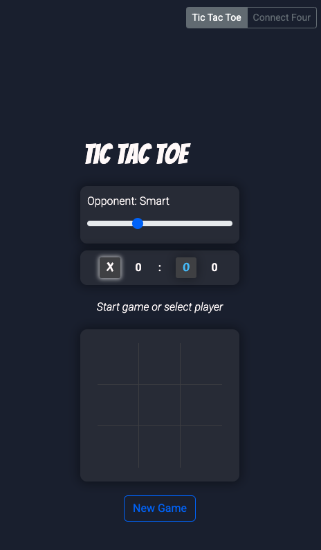
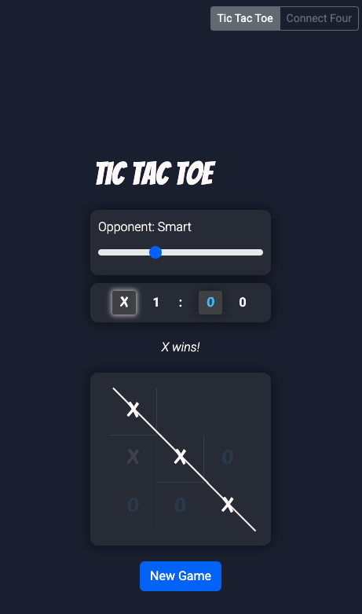
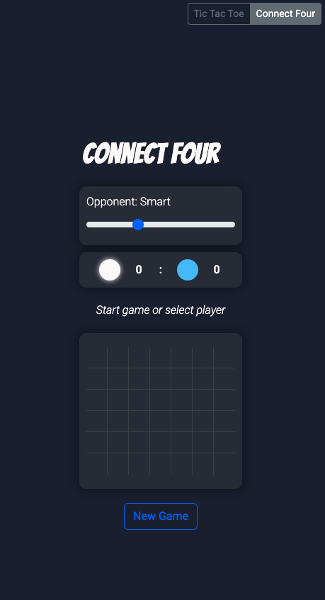
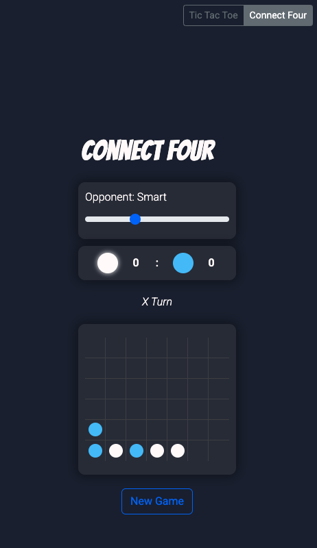

# Tic-Tac-Toe & Connect Four

A classic game project featuring both Tic-Tac-Toe and Connect Four. Each game includes an AI opponent powered by the Minimax algorithm. This project was developed to explore and implement the complexities of game theory and artificial intelligence in familiar settings.

## Features

*   Classic 3x3 Tic-Tac-Toe gameplay.
*   Classic 6x7 Connect Four gameplay with drop animations.
*   Play against an AI opponent with multiple difficulty levels.
*   2 Player mode available for both games.
*   Option for the AI to make the first move.
*   Clean, switchable interface for both games.

## How to Play

### Tic-Tac-Toe

1.  The game is played on a 3x3 grid.
2.  The human player is typically assigned 'X' and the AI player 'O'.
3.  Players take turns placing their marks in empty squares on the grid.
4.  The first player to get 3 of their marks in a row (up, down, across, or diagonally) is the winner.
5.  When all 9 squares are full, the game is over. If no player has 3 marks in a row, the game ends in a tie.

### Connect Four

1.  The game is played on a 6-row, 7-column grid.
2.  Players take turns dropping their colored discs into one of the seven columns.
3.  The disc falls to the lowest available space within the selected column.
4.  The first player to get 4 of their discs in a row (horizontally, vertically, or diagonally) is the winner.
5.  If the grid is filled and no player has won, the game is a draw.

## AI Opponent - The Minimax Algorithm

The hardest AI opponent in both games utilizes the **Minimax algorithm** to determine its optimal move. Minimax is a decision-making algorithm commonly used in two-player turn-based games.

*   **How it works:** The algorithm explores all possible game states from the current position down to the terminal states (win, loss, or draw).
*   It assigns a score to each terminal state (e.g., +1 for AI win, -1 for player win, 0 for a draw).
*   Working backward from these terminal states, it chooses moves that maximize its own score (assuming the opponent plays optimally to minimize the AI's score).
*   This recursive approach allows the AI to "look ahead" and make strategic decisions to either win or force a draw if a win is not possible.

## Key Folders and Files

- **`src/js/components/`**: JavaScript modules for UI and game interactions.
- **`src/js/constants/`**: Project-wide constants.
- **`src/js/services/`**: Core game logic and data management.
- **`src/js/main.js`**: Entry point for initializing the game.
- **`src/css/global.css`**: Main stylesheet for the game.

## Technologies Used

*   **JavaScript (ES6+):** For game logic, interactions, and data management.
*   **Bootstrap:**
*   **HTML5:**
*   **CSS3:**

## Future Enhancements

*   Enhanced visual transitions and animations.
*   Add more classic board games.

## Screenshots

### Tic-Tac-Toe

### Alert

### Game Over

### Connect Four

## Demo
https://mght00.github.io/tic-tac-toe/

## Acknowledgements

*  This project was inspired by the desire to understand and implement fundamental AI algorithms. I learned all about minimax and other minimax-related game logic from the following websites:
  *  https://www.geeksforgeeks.org/minimax-algorithm-in-game-theory-set-1-introduction/
  
  * https://www.geeksforgeeks.org/finding-optimal-move-in-tic-tac-toe-using-minimax-algorithm-in-game-theory/

*   This project benefited greatly from the assistance of AI tools. I would like to extend my thanks to both Gemini and ChatGPTfor their creative suggestions, problem-solving capabilities, and code refinement. Their contributions were instrumental in making this project what it is today.
